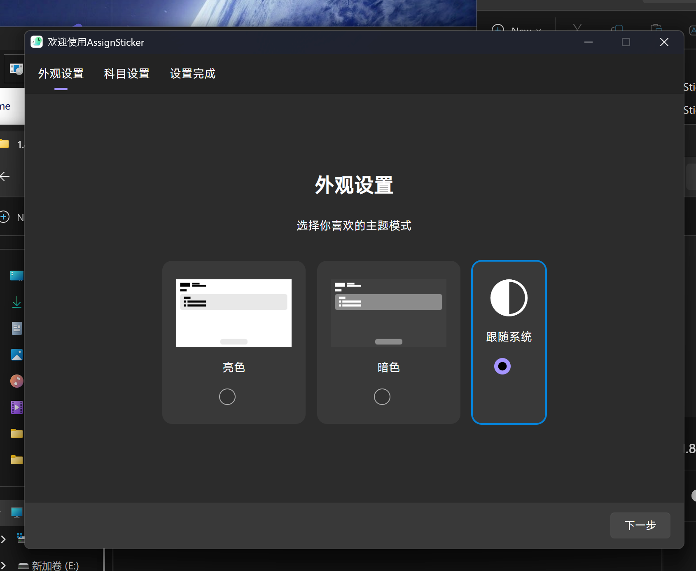
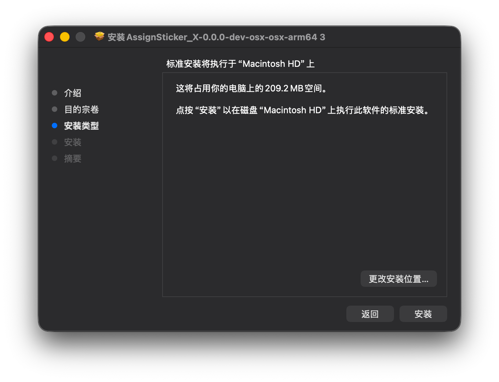
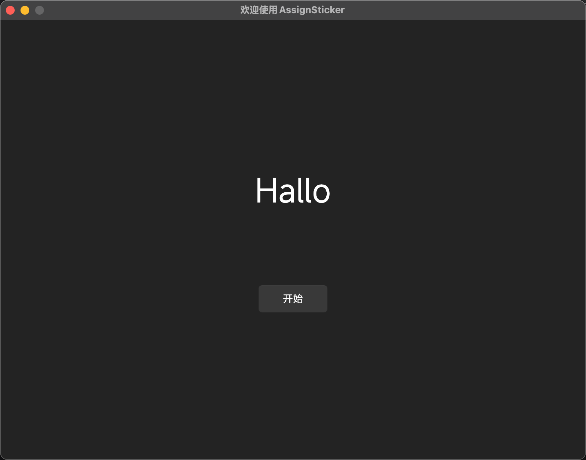
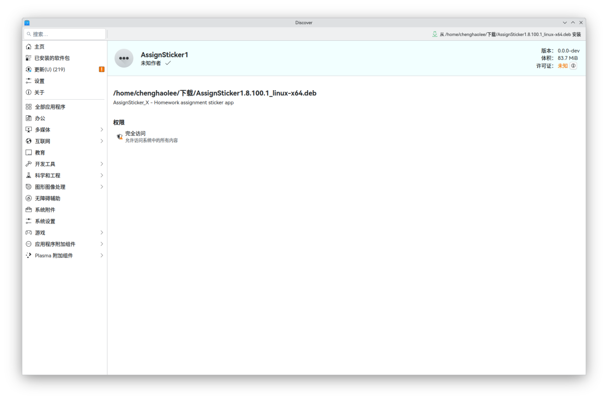

现在让我们从头开始，教您如何从下载->安装AssignSticker。

首先，根据您的操作系统从[镜像源](https://stk.sectl.cn/AssignSticker/1.8.100)或者[GitHub仓库的releases页面](https://github.com/SECTL/AssignSticker/releases)下载。

下载完成后，请根据您的操作系统按照下面的操作安装。

::: tabs
@tab  Windows

:::: steps

1. 下载Windows版AssignSticker安装包
2. 打开安装包，根据提示完成安装
3. 安装完毕打开AssignSticker
4. 按照提示完成初始设置。

   

@tab macOS

> [!NOTE]
> AssignSticker并不是能在所有的macOS版本上都能正常运行。
>
> 以下是AssignSticker在M系列芯片和intel系列芯片的macOS支持版本范围：
>
> Intel macOS：≥macOS 10.15 Catalina
>
> arm macOS：≥ macOS 11 bigsur

:::: steps

1. 下载对应您 Mac 处理器的AssignSticker安装程序。
2. 双击 pkg 安装包，开始安装。

   
3. 安装完成后，打开AssignSticker。
4. 按照提示完成初始设置。

   

@tab Linux

> [!TIP]
> 在不同的 Linux 发行版上，包管理器并不近相同。
> AssignSticker目前只提供适用于 Debian GNU/Linux 的.deb安装包格式，后续会提供更多格式。

下面开始介绍安装。以Debian13+KDE Plasma桌面做演示。

图形化安装：

:::: steps

1. 直接打开下载下来的.deb包，打开桌面环境自带的图形化包管理（这里用 KDE的discover做演示）直接点击安装按钮即可。

   

> [!TIP]
> 在部分Linux 发行版上，图形化包管理器可能会要求您输入登录密码，输入即可。

2. 稍等一会会提示安装完成，直接启动即可。
3. 启动成功后，按照提示完成初始化设置即可。

命令行安装：

:::: steps

1. 打开您的 Linux 终端，执行以下命令(**后面的"/replace/your/path"字段删掉替换成自己实际的 deb包路径。**）

   ```
   sudo dpkg -i /replace/your/path
   ```

> [!CAUTION]
> **请根据自己的处理器架构下载对应的 Linux 版AssignSticker安装包**，我们提供了供 arm64 和x64用户安装的 deb安装包，如果是错误的架构的话，则无法安装。
> 因为选错安装包而无法安装产生的反馈，我们不予理睬，敬请理解。


:::
