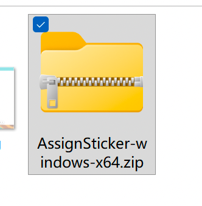
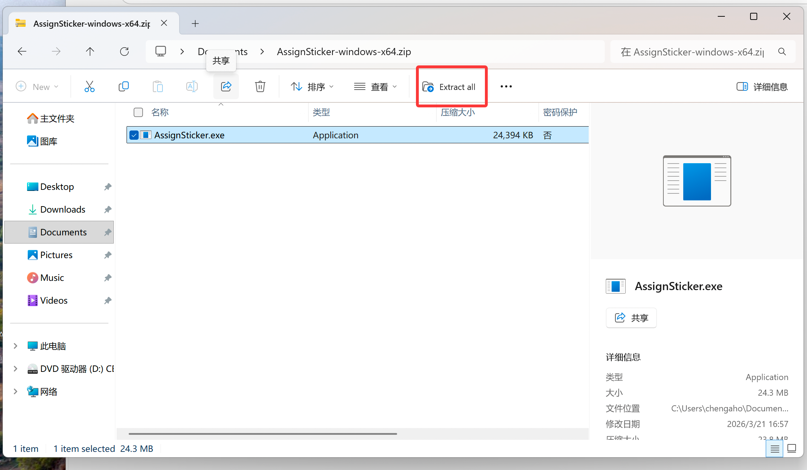
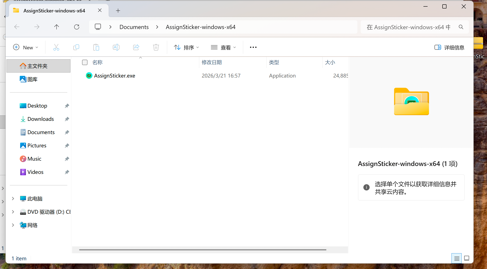

**再次感谢您选择AssignSticker!**

现在让我们从下载开始，一起设置AssignSticker.

## **AssignSticker目前提供以下版本**：

- 1.2.0.1 正式版 **（早期版本，不建议使用）**
- 1.2.0.2 beta-1 **（也是早期版本，比上述的1.2.0.1稍微好用一点）**

> [!WARNING] 
>以上版本**已经不再维护**，请使用下面的新版本。

- 1.3.0(开发中的全新版本，**bug较多，不建议使用**）

> [!TIP] 
> 1.3.0**弃用了1.2.0.x以来使用的PyQt5+Qtquick开发框架**，我们正在迁移到**Pywebview框架**，将为用户带来更直观、更美观的界面和更加方便的功能。我们将在**2026年5月或者6月**发布基于Pywebview构建的全新1.3版本，敬请期待

现在，AssignSticker兼容以下操作系统。
- Windows 10及以上版本（x86和arm64通用）
- Linux（~~适用于搭载了国产UOS教育版、deepin、银河麒麟的希沃/鸿合一体机，~~理论上支持所有的Linux发行版。x86和arm64通吃）

## 第一步：获取AssignSticker

AssignSticker在以下渠道提供预编译的二进制文件存档：

- [GitHub releases](https://github.com/SECTL/AssignSticker/releases)
- [官方镜像源](https://stk.sectl.top/AssignSticker)
- [Github Actions **（不稳定）**](https://github.com/SECTL/AssignSticker/actions)

## 第二步：安装

在上述网页获取到的AssignSticker通常是一个.zip压缩包（如图）

现在让我们解压它

> [!TIP] 
> 在Windows操作系统中，您可以直接双击打开压缩包，然后在压缩包页面直接点击“全部解压”或者“Extract All”即可开始解压
> 
> （这里用Windows11做演示，Windows10同上）

解压完成后打开解压后的文件夹，您会看到一个名为**"AssignSticker.exe"**的exe可执行文件。

双击运行，稍等一会即可开始使用AssignSticker。